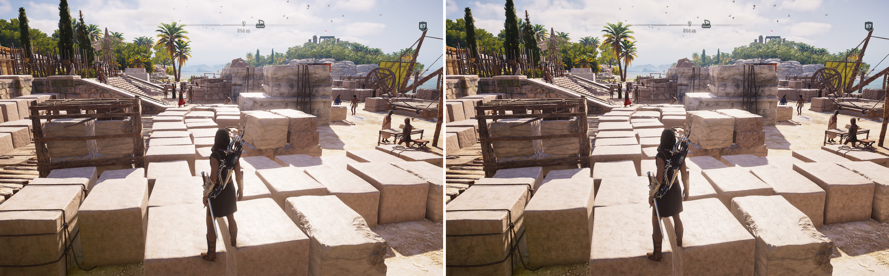
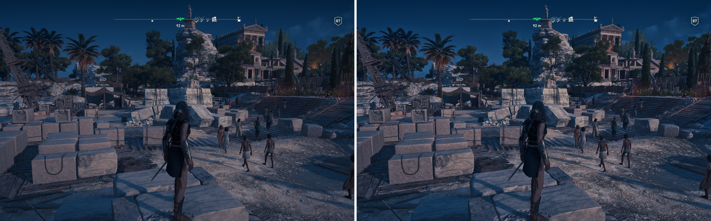

# fxshot

fxshot runs a [ReShade](https://reshade.me/) effect over an image from the
command line, with no game and no overlay.

ReShade only works hooked into a running application, so seeing what an effect
does normally means launching a game, walking to the right spot and squinting.
That makes a shader hard to tune and impossible to regression test, especially
when the change being judged moves the picture by two levels out of 255.

fxshot builds the textures, mip chains and sampler states ReShade would and runs
the technique's passes in order on Direct3D 11. The shaders are the effect's
own, compiled by the real HLSL compiler, so what runs is what is in the `.fx`
file.

The example frames, untouched on the left and through the effect on the right:





## Scope

Textures with mip chains, samplers, scalar and vector uniforms, `#include`,
namespaces, functions that take a sampler, ordered passes and per-frame state.
No depth buffer, motion vectors or compute passes; an effect that samples depth
is handed the colour image instead.

## Requirements and build

Windows, a D3D11 capable GPU, and MSVC with the Windows SDK (the "Desktop
development with C++" workload). Python 3.13 or newer to translate an effect;
the scripts in `tools\` also want numpy and pillow.

`build.bat` finds Visual Studio and builds `fxshot.exe`. From a developer
prompt the command is:

```
cl /nologo /EHsc /O2 /std:c++17 src\fxshot.cpp /Fe:fxshot.exe /link /SUBSYSTEM:CONSOLE
```

CMake works too: `cmake -B build -S .` then `cmake --build build --config Release`.

## Worked example

Everything here is in `examples\`: frames from Assassin's Creed Odyssey and the
Aegean Light 1.2 preset for PHDRPlus, which was tuned with this tool.

Translate the effect for the resolution you want. Buffer size is baked in,
because effects branch on `BUFFER_WIDTH` at compile time.

```
python src\translate.py examples\PHDRPlus.fx examples\generated 960 600
```

```
technique DZ_PerceptualHDR: 18 passes, 19 textures, 19 samplers, 64 uniforms
engine-fed uniforms: FrameTime, FrameCount
```

That writes `effect.hlsl` and `manifest.txt`, the resources the host has to set
up. Then render:

```
.\fxshot --hlsl examples\generated\effect.hlsl --manifest examples\generated\manifest.txt --params examples\preset.ini --noise examples\dz_stbn_512x256.png --in examples\day.png --out examples\out\day.png
```

The output is the size of the input, 24 bit RGB. Measured against the sources
with `tools\analyse.py`:

```
day    scene_mean 0.556 | detail sh 1.080 mid 1.052 hi 1.022 | shift -0.0086
night  scene_mean 0.169 | detail sh 1.145 mid 1.204 hi 1.246 | shift +0.0112
```

Local detail rises in every band, daylight gets slightly darker and night a
little brighter, which two screenshots viewed in turn will not show you.

## Options

- `--params` takes a preset `.ini` as ReShade saves it, vectors comma
  separated. A missing uniform falls back to the effect's default, as in
  ReShade, and fxshot says so, since a typo looks exactly like an omission.
- `--defaults FILE` on the translate step writes a preset with every uniform at
  its default.
- `--noise` supplies the image for textures declared with `source = "..."`.
  Only one is supported.
- `--frames N` runs the frame loop N times, default 40, so eye adaptation and
  other temporal state can settle. State is cleared between images.
- `--adapter` picks the GPU by index or part of its name. The default is the
  one with the most video memory, because DXGI often lists the integrated GPU
  first.
- `--batch FILE` renders one job per line, `preset.ini<TAB>input<TAB>output`,
  paying for device creation and shader compilation once. Presets may differ
  between lines, which is what makes sweeps practical.

```
.\fxshot --hlsl examples\generated\effect.hlsl --manifest examples\generated\manifest.txt --noise examples\dz_stbn_512x256.png --batch jobs.txt
```

A texture that asks for more mip levels than its size allows is an error here,
because ReShade refuses to create it and the effect would not load in game.

`FXSHOT_TRACE=1` prints each pass and the adapters found. `FXSHOT_DEBUG=1`
turns on the D3D11 debug layer if Graphics Tools is installed.

### HDR

`--color-space 2` on the translate step compiles for a scRGB swap chain. The
input is then a PFM of linear RGB in nits. Output to `.pfm` gives the swap chain
in nits; output to `.png` shows what an SDR desktop displays. `--present linear`,
the default, sRGB encodes as Windows does when the game declares its colour
space, and `--present code` writes the values as they are, which is what a game
switched to HDR through the GPU driver looks like. Both match desktop captures.

## How close it is to ReShade

On PHDRPlus, an 18 pass effect with eye adaptation, guided filter pyramids,
debanding and blue noise dithering:

- At intensity zero the output is bit for bit identical to the input.
- Against a ReShade capture of the same frame and preset, 80% of pixels match
  exactly, 99.5% are within 2 levels and the mean difference is 0.14.

That residual is the effect's frame indexed dither: the signed mean was 0.0003,
the channels disagreed independently, and the differences sat in flat regions
rather than at edges.

## Checking an effect compiles in ReShade

fxshot compiles the translated HLSL, which can succeed where ReShade's own
compiler fails. `tools\reshadefx\` builds that compiler from a ReShade 6.8
source checkout, and `allmodes.py` compiles each `PS_` and `VS_` entry point in
colour spaces 1 to 3, both normally and with uniforms as constants. The second
is ReShade's performance mode, and the one that usually goes untested. It prints
failures and branch attribute warnings, then a problem count.

```
tools\reshadefx\build.bat C:\src\reshade
```

```
python tools\reshadefx\allmodes.py examples\PHDRPlus.fx
```

Effects can also be named without `.fx` and found in a folder given by `--dir`,
the current folder by default.

## Analysis tools

`tools\` holds what was built to tune presets with fxshot. None of it is needed
to render.

- `analyse.py` measures local detail per tonal band, clipping, brightness shift,
  ringing and dark rims. Use `ringing` rather than `overshoot` when overall
  brightness moves: it carries neighbourhood bounds through the frame's own tone
  curve, so a uniform shift does not read as a halo.
- `chroma.py` measures per channel colour drift, and grain added where the
  image was flat.
- `sweep.py` renders a parameter grid in one batch and ranks the results. It
  uses the blue noise texture in `examples` unless `--noise` names another.
- `compare.py` builds captioned before and after sheets.
- `checkpreset.py` checks a preset against each slider's `ui_min` and `ui_max`,
  since fxshot renders values the overlay cannot set:
  `python tools\checkpreset.py examples\PHDRPlus.fx examples\preset.ini`

## Development note

AI assistance was used during development, for reviewing code, finding bugs,
refining the implementation and writing documentation. All changes were reviewed
and tested before being included.

## License

MIT. Use, modify and redistribute freely. Credit is appreciated but not
required.
